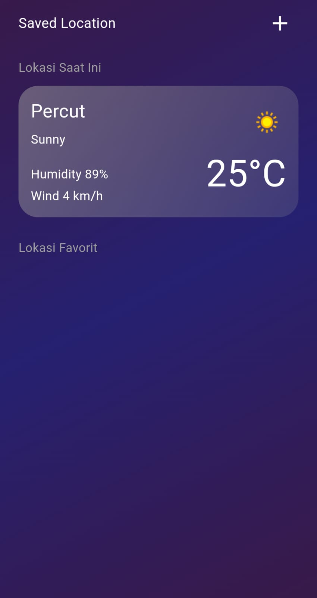
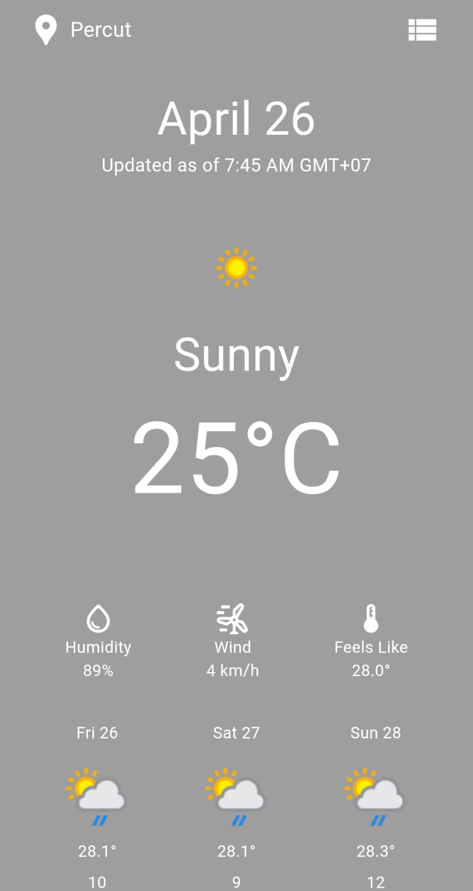
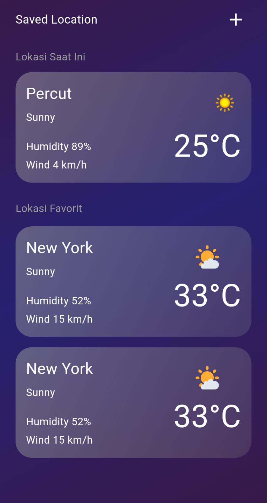

# Weather App

Weather Application with riverpod and dio 

## Getting Started

Second Time using Riverpod it's challenging but it's fun

## Content

- [x] Riverpod
- [x] Dio
- [x] API
- [x] Animation Page
- [x] User Location

## Preview Project

 
  
<h2>🛠️ Preview</h2>

  

    <h3>Search Page</h3>
    
  

  

    <h3>Main Page</h3>
    
  

  

    <h3>Draft Page</h3>
    
  

<!--     <h3>Video Task</h3> -->
<!--      -->

